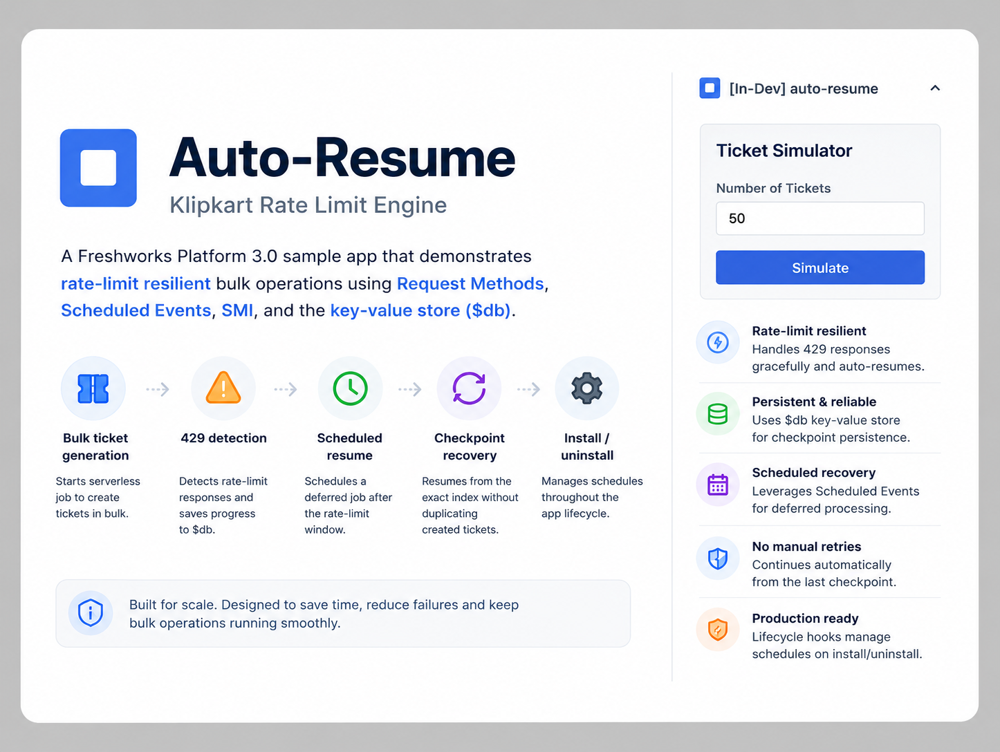

<p align="center">
  
</p>

# Auto-Resume — Klipkart Rate Limit Engine

A Freshworks Platform 3.0 sample app that demonstrates **rate-limit resilient bulk operations** using **Request Methods**, **Scheduled Events**, **SMI**, and the platform **key-value store** (`$db`).

## Description

High-volume ticket creation during flash sales or migrations routinely hits Freshdesk **429 Too Many Requests** responses. Auto-Resume saves progress to `$db`, schedules a deferred resume job, and continues from the last checkpoint — eliminating manual retry loops.

### Core Functionality

1. **Bulk ticket generation** — sidebar triggers serverless `start_generation` to create tickets via Request Templates.
2. **429 detection** — intercepts rate-limit responses and persists cursor state to `$db`.
3. **Scheduled resume** — `$schedule.create` re-awakens processing after the rate-limit window.
4. **Checkpoint recovery** — resumes from the exact index without duplicating created tickets.
5. **Install/uninstall lifecycle** — provisions and tears down schedules on app install and uninstall.

## User Interfaces

| Surface | Placement | Behavior |
| --- | --- | --- |
| `app/index.html` | `support_ticket.ticket_sidebar` | Start bulk generation, view progress, trigger resume flow |

## Platform 3.0 Features Used

### 1. Request Methods — Bulk Ticket Creation

`config/requests.json` defines a `createTicket` template. The serverless handler loops through a batch and catches HTTP 429 responses.

### 2. Key-Value Store — Checkpoint Persistence

```javascript
await $db.set('run:' + runId, { total, index, status: 'paused' });
```

Progress cursor and remaining payload are stored so a scheduled job can pick up where the batch stopped.

### 3. Scheduled Events — Deferred Resume

When rate limited, the app creates a short-lived schedule (minimum platform interval applies) to retry after the reset window:

```javascript
await $schedule.create({ name: scheduleName, data: { runId, nextIndex }, schedule_at: resumeAt });
```

### 4. SMI — Serverless Method Invocation

The sidebar invokes `start_generation` via `client.request.invoke` to run batch logic securely server-side.

## Project Structure

```
├── app/
│   ├── index.html              # Sidebar — start/resume controls
│   ├── app.js
│   └── styles/
├── config/
│   ├── iparams.json
│   └── requests.json           # createTicket template
├── server/
│   ├── server.js               # SMI + lifecycle + scheduled resume
│   └── lib/handle-response.js
├── manifest.json
├── usecase.md
└── README.md
```

## Prerequisites

- [Freshworks CLI (FDK)](https://developers.freshworks.com/docs/app-sdk/v3.0/support_ticket/basic-dev-tools/freshworks-cli/) v10.1.2 or later
- Node.js v24.x
- A Freshdesk trial account with API access configured in installation parameters

Enable global apps before local development:

```bash
fdk config set global_apps.enabled true
```

## Local Development

1. Clone the repository:
   ```bash
   git clone <repo-url>
   cd auto-resume
   ```

2. Install dependencies, validate, and run:
   ```bash
   npm install
   fdk validate
   fdk run
   ```

3. Configure installation parameters when prompted during install (or at `http://localhost:10001/custom_configs` when running locally):
   - **Freshdesk API key** — agent key from Profile Settings (enter the key only; the app appends `:X` for Basic auth)

4. Open Freshdesk with `?dev=true` and use the sidebar to start a bulk generation run:
   ```
   https://your-domain.freshdesk.com/a/tickets/1?dev=true
   ```

5. Simulate rate limits by lowering batch sizes in installation parameters and observe scheduled resume in the FDK logs.

Reset local installation parameters when re-testing:

```bash
rm .fdk/store.sqlite
fdk run
```

## Key Learnings

1. **Secure iparams stay server-side** — `apikey` is marked `"secure": true`, so it is not returned to the frontend via `client.iparams.get()`. Auth runs in the serverless handler through `config/requests.json`.
2. **Pause-and-resume** — never retry 429s in a tight loop; persist state and defer to `$schedule`.
3. **Idempotent checkpoints** — store the last successful index so resumed runs skip already-created records.
4. **Storage limits** — segment large batch arrays to stay within the 100 KB `$db` value limit; purge keys after successful completion.

## Resources

- [Request methods](https://developers.freshworks.com/docs/app-sdk/v3.0/support_ticket/advanced-interfaces/request-method/)
- [Scheduled events](https://developers.freshworks.com/docs/app-sdk/v3.0/common/serverless-apps/scheduled-events/)
- [Serverless data store](https://developers.freshworks.com/docs/app-sdk/v3.0/common/serverless-apps/data-store/)
